# Percona Server MySQL (Docker + Debian)

> **Projeto em andamento:** Novos testes ainda serão implementados.

Este projeto disponibiliza um ambiente **Percona Server for MySQL** rodando em **Docker**, baseado em **Debian**.

A ideia é explorar o suporte experimental a Stored Programs em JavaScript (JS), recurso introduzido recentemente pelo Percona.

Minha intenção com este projeto é **testar e experimentar** essa novidade do Percona Server MySQL.

Pode ver a publicação oficial no link abaixo:

[Introducing Experimental Support for Stored Programs in JS in Percona Server for MySQL](https://www.percona.com/blog/introducing-experimental-support-for-stored-programs-in-js-in-percona-server-for-mysql/).  

Objetivos do projeto:

- Subir um container a partir de uma **imagem Debian**,  
- Instalar e configurar os **repositórios oficiais do Percona**,  
- Criar funções e procedures em **JavaScript dentro do MySQL**,  
- Fazer **testes de performance e usabilidade** para avaliar se esse recurso pode ajudar em transformações diretamente no banco de dados.  

Este projeto é **puramente experimental** e serve para aprendizado, curiosidade e testes.

Documentações de apoio:  
- [Percona Software Repositories Documentation](https://docs.percona.com/percona-software-repositories/index.html)
- [JS stored procedure and function overview](https://docs.percona.com/percona-server/8.4/js-lang-overview.html) 

## Índice

1. [Início rápido](#início-rápido)
2. [Setup detalhado](#setup-detalhado)
    1. [Estrutura do projeto](#estrutura-do-projeto)
    2. [Build da imagem](#build-da-imagem)
    3. [Subindo o container](#subindo-o-container)
    4. [Acessando o container](#acessando-o-container)
    5. [Conectando no banco de dados](#conectando-no-banco-de-dados)
3. [Criando funções e procedures em JavaScript](#criando-funções-e-procedures-em-javascript)
    1. [Instalando o JS stored program](#instalando-o-js-stored-program)
    2. [Criando funções e procedures em JavaScript no Percona Server MySQL](#criando-funções-e-procedures-em-javascript-no-percona-server-mysql)
    3. [Exemplo de criação de função em JS](#exemplo-de-criação-de-função-em-js)
    4. [Exemplo de criação de uma procedure em JS](#exemplo-de-criação-de-uma-procedure-em-js)
    5. [Exemplo de procedure com parâmetros IN e OUT](#exemplo-de-procedure-com-parâmetros-in-e-out)
4. [Consultando rotinas JS com INFORMATION_SCHEMA.ROUTINES](#consultando-rotinas-js-com-information_schemaroutines)
5. [Usando console.log e visualizando logs/erros de JS](#usando-consolelog-e-visualizando-logserros-de-js)
    1. [Criando uma procedure com console.log](#criando-uma-procedure-com-consolelog)
    2. [Visualizando erros no JS](#visualizando-erros-no-js)
    3. [Criando um erro personalizado](#criando-um-erro-personalizado)
6. [Testes de performance](#testes-de-performance)
    1. [Capitalização de textos](#captalização-de-textos)
    2. [Comparativo entre funções UPPER, LENGTH e TO_BASE64](#comparativo-entre-funções-upper-length-e-to_base64)
    3. [Criando função de ULID](#criando-função-de-ulid)
    4. [Realizando INSERT em loop usando a função ULID](#realizando-insert-em-loop-usando-a-função-ulid)
7. [Erros comuns](#erros-comuns)
    1. [Erro ao conectar via GUI](#erro-ao-conectar-via-gui)
    2. [Erro: This function has none of DETERMINISTIC](#erro-this-function-has-none-of-deterministic)
    3. [Erro de privilégio CREATE_JS_ROUTINE](#erro-de-privilégio-create_js_routine)

## Início rápido

Se você quer subir o ambiente e começar a testar rapidamente, use o comando abaixo:

```bash
docker build -t percona-debian:1.0 . && \
docker-compose up -d && \
docker exec -it my-percona bash /tmp/grant_root_permission.sh && \
docker exec -it my-percona bash /tmp/install_js_programs.sh
```

Esse comando faz, em sequência:

1. Build da imagem percona-debian:1.0
2. Sobe o container via docker-compose
3. Executa os scripts de permissões do root e de instalação dos componentes JS programs

> O MySQL ficará disponível na porta 9999 por padrão. Para alterar, edite o arquivo .env.

## Setup detalhado

### Estrutura do Projeto 

```
percona-mysql-js/
├── .env
├── docker-compose.yml
├── Dockerfile
├── README.md
│
├── images/
│   ├── error_connect.png
│   ├── error_deterministic.png
│   ├── fn_fact.png
│   └── sp_is_prime.png
│
├── js_functions/
│   ├── fn_fact.js
│   └── fn_generate_ulid.js
│
├── scripts/
│   ├── grant_root_permission.sh
│   └── install_js_programs.sh
│
└── sql_queries/
    └── routines_info.sql
```

### Build da imagem

Crie a imagem Docker a partir do **Dockerfile**, use o comando abaixo:

```bash
docker build -t percona-debian:1.0 .
```

### Subindo o container

Após criar a imagem, suba o container com:

```bash
docker-compose up -d
```
> O MySQL ficará disponível na porta 9999 por padrão. Para alterar, edite o arquivo .env.

Quando quiser parar o container, use:

```bash
docker-compose down
```

### Acessando o container

Para entrar no container do Percona Server, utilize o comando:

```bash
docker exec -it my-percona bash
```

### Conectando no banco de dados

Para acessar o MySQL, utilize as seguintes credenciais:

- **Servidor:** `localhost`
- **Porta:** `9999`
- **Usuário:** `root`

> Por padrão, o Percona Server for MySQL é inicializado com o usuário `root` e sem senha configurada.

## Criando funções e procedures em JavaScript

### Instalando o JS stored program

Para instalar o componente JS no Mysql, basta executar o script `install_js_programs.sh`.

Use o comando abaixo:

```bash
docker exec -it my-percona bash /tmp/install_js_programs.sh
```

### Criando funções e procedures em JavaScript no Percona Server MySQL

Para criar e testar **funções** ou **procedures** em JavaScript no **Percona Server for MySQL**, o melhor é usar diretamente o **terminal mysql** para garantir maior compatibilidade.

Utilize os comandos `CREATE FUNCTION` ou `CREATE PROCEDURE` sempre incluindo a cláusula `LANGUAGE JS` para indicar que o corpo será escrito em JavaScript.

O código JavaScript deve ser delimitado por `$$` para evitar conflitos com o delimitador padrão do MySQL.

> **Observação:**  
> Em versões mais antigas do MySQL, pode ser necessário alterar o delimitador padrão utilizando o comando `DELIMITER $$` antes de criar a função ou procedure. Isso garante que o cliente mysql interprete corretamente o início e o fim do

Exemplo:

```sql
CREATE FUNCTION f1(n INT) RETURNS INT LANGUAGE JS AS $$
return n * 42;
$$;

CREATE PROCEDURE p1(a INT, b INT, OUT r INT) LANGUAGE JS AS $$
r = a * b;
$$;
```

### Exemplo de criação de função em JS:

Criando uma função que calcula o fatorial de n.

```sql
CREATE FUNCTION fn_fact(n INT)
RETURNS BIGINT
DETERMINISTIC
LANGUAGE JS
AS $$

let result = 1;
while (n > 1) {
        result *= n;
        n--;
}
return result;

$$;
```

Testando a função:

```sql
SELECT fn_fact(5);
```

Screenshot:


### Exemplo de criação de uma procedure em JS

Ao criar uma procedure com JS programs, alguns pontos de atenção:

- O `returns` **não é usado** em `CREATE PROCEDURE`, ele é usado apenas em `CREATE FUNCTION`.  
- **Procedures não retornam valores diretamente**. Para retornar alguma informação, você deve usar os parâmetros `IN` e `OUT`.  
- Se você deseja que o valor seja retornado diretamente via `return`, então precisa criar uma **FUNCTION**.

### Exemplo de Procedure com parâmetros `IN` e `OUT`:

Criando uma procedure que verifica se é um número primo.

``` sql
CREATE PROCEDURE sp_is_prime(IN n INT, OUT is_prime BOOLEAN)
LANGUAGE JS
AS $$

if (n < 2) {
    is_prime = false;
} else {
    is_prime = true;
    for (let i = 2; i <= Math.sqrt(n); i++) {
        if (n % i === 0) {
            is_prime = false;
            break;
        };
    };
};

$$;
```

Para testar, chame a procedure:

```sql
CALL sp_is_prime(10, @resultado);
```

Depois, veja o resultado:

```sql
SELECT @resultado;
```

Screenshot:

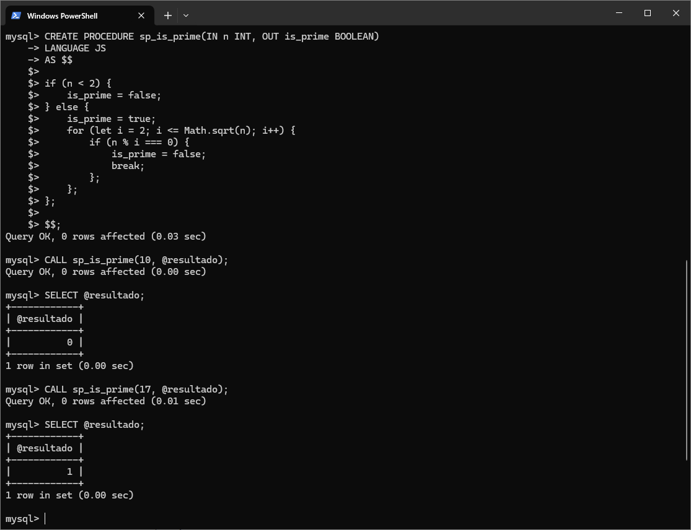


## Consultando rotinas JS com INFORMATION_SCHEMA.ROUTINES

A tabela `INFORMATION_SCHEMA.ROUTINES` no MySQL armazena informações sobre todas as rotinas criadas no banco de dados, como funções e procedures. Isso inclui também rotinas escritas em JavaScript utilizando a cláusula `LANGUAGE JS`.

Nessa tabela temos as seguintes informações:

- **routine_schema**: O banco de dados ao qual a rotina pertence.
- **routine_name**: O nome da rotina (função ou procedure).
- **routine_definition**: O código-fonte da rotina (por exemplo, o código JavaScript).
- **external_language**: A linguagem em que a rotina foi escrita (por exemplo, JS para rotinas JavaScript).

Exemplo de consulta que retorna todas as rotinas (funções e procedures) escritas em JavaScriptt (`LANGUAGE JS`):

```sql
SELECT
        routine_schema,
        routine_name,
        routine_definition,
        external_language
FROM
        ATION_SCHEMA.ROUTINES
WHERE
        external_language='JS';
```

Exemplo de consulta para obter informações de uma função JavaScript chamada `fn_fact`:

```sql
SELECT
        routine_schema,
        routine_name,
        routine_definition,
        external_language
FROM
        INFORMATION_SCHEMA.ROUTINES
WHERE
        routine_name='fn_fact';
```     

Essas consultas retorna o esquema, nome, a definição completa do código JavaScript e indica que a linguagem externa é JS.

## Usando `console.log` e visualizando logs/erros de JS

### Criando uma procedure com `console.log`:

Você pode utilizar `console.log` dentro de rotinas JS para registrar informações de debug.

Exemplo:

```sql
CREATE PROCEDURE sp_console_log()
LANGUAGE JS
AS $$

	console.log("Hello, World!");
	
$$;
```

Depois de chamar a procedure, use as funções abaixo para visualizar os logs:

```sql
SELECT JS_GET_CONSOLE_LOG();
SELECT JS_GET_CONSOLE_LOG_JSON();
```

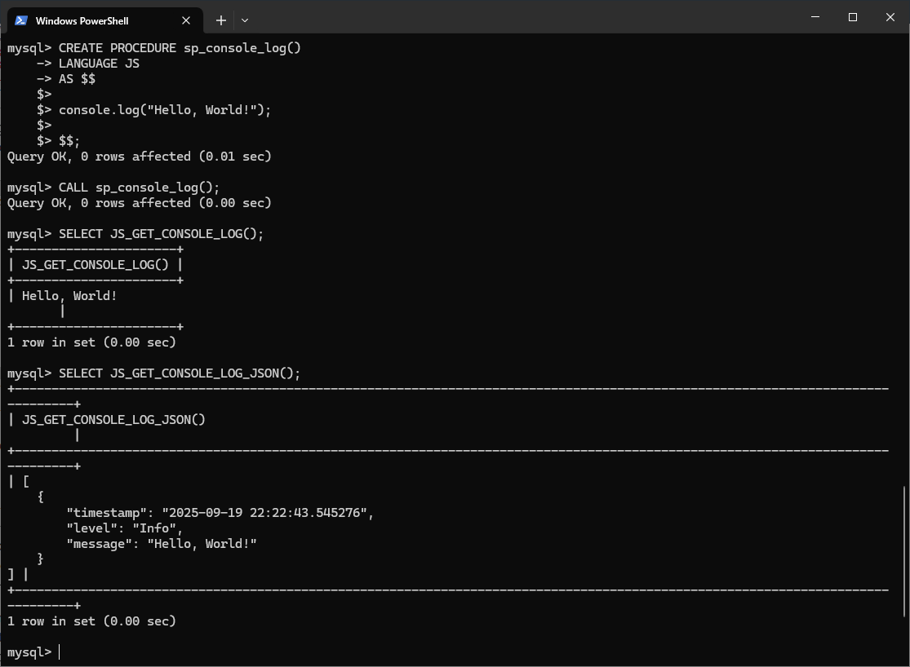

Para limpar o histórico de mensagens, use `JS_CLEAR_CONSOLE_LOG()`:

```sql
SELECT JS_CLEAR_CONSOLE_LOG();
```

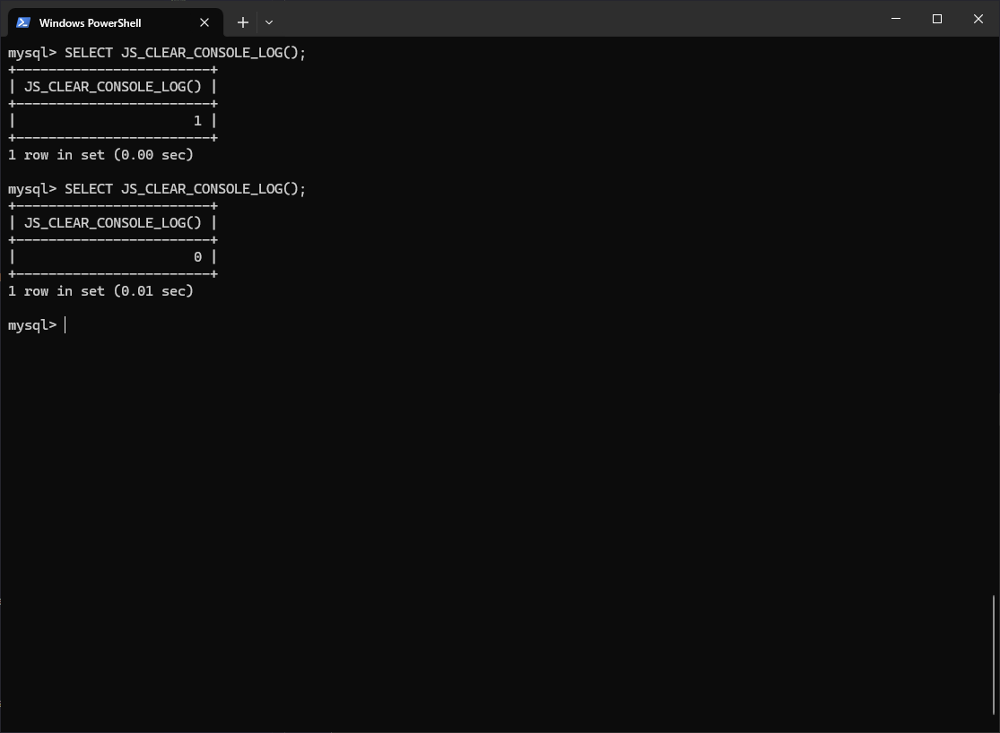

O retorno mostra a quantidade de mensagens apagadas.

Se executar novamente logo em seguida, o valor retornado será 0.

O exemplo abaixo mostra o resultado após executar a procedure 3 vezes:

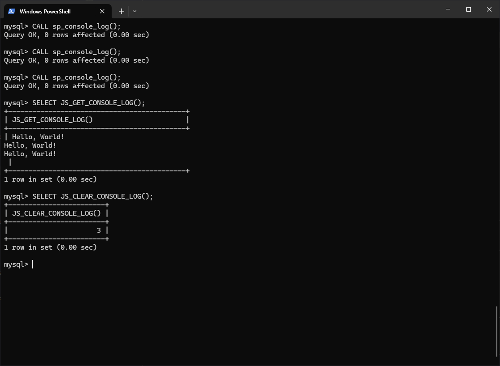

### Visualizando erros no JS:

Criei uma procedure que chama uma função que não existe:

```sql
CREATE PROCEDURE sp_error_test()
LANGUAGE JS
AS $$

	myFunction();
	
$$;
```

Ao executar essa procedure, um erro será exibido. Para visualizar o registro do erro, pode usar as funções abaixo:

```sql
SELECT JS_GET_LAST_ERROR();
SELECT JS_GET_LAST_ERROR_INFO();
```

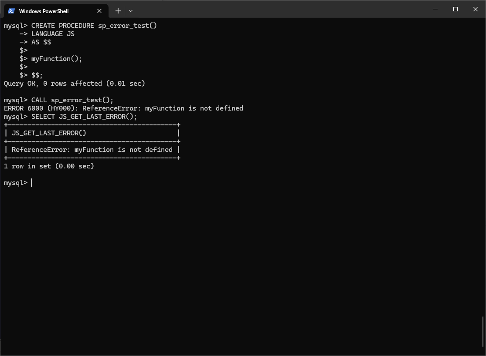

### Criando um erro personalizado:

Exemplo de procedure que calcula o tamanho de uma string. Se o parâmetro passado estiver vazio, um erro personalizado será lançado:

```sql
CREATE PROCEDURE sp_len(IN str VARCHAR(255), OUT len INT)
LANGUAGE JS
AS $$

if (str) {
	len = str.length;
} else {
	throw "Parameter is empty!";
}

$$;
```

Ao executar essa procedure com um parâmetro vazio, o erro personalizado será exibido:

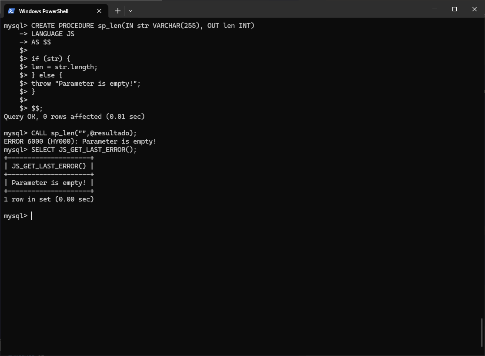

# Testes de performance

Chegamos a melhor parte do projeto!

Aqui vou demonstrar alguns testes de performance de funções e procedures usando JavaScript no MySQL. Também vou fazer comparações entre funções com SQL puro e JS programs, ver se existem diferenças de desempenho e em quais cenários cada abordagem se sai melhor.

Nos resultados dos testes abaixo, podem existir campos que chamei de **Speedup** e **Ganho**:

- Speedup: Indica quantas vezes o teste otimizado é mais rápido que o teste original.
```
Speedup = tempo_original / tempo_otimizado
```

- Ganho de Performance: Medida percentual da redução no tempo ou recurso consumido em comparação ao teste original.
```
Ganho = (tempo_original - tempo_otimizado) / tempo_original * 100
```

## Captalização de textos:

O objetivo do teste é capitalizar todo o texto, ou seja, deixar a primeira letra de cada palavra em maiúsculo.

Criamos duas funções para isso:
- Uma usando SQL puro  ([fn_sql_capitalize_words](sql_queries/fn_sql_capitalize_words.sql))
- Outra usando JavaScript (JS Programs) ([fn_js_capitalize_words](sql_queries/fn_js_capitalize_words.sql))

O intuito é comparar o desempenho e entender qual abordagem se sai melhor em termos de velocidade e eficiência.

No primeiro teste, utilizei o método [BENCHMARK](https://dev.mysql.com/doc/refman/8.4/en/select-benchmarking.html) do MySQL. Ele permite simular a execução de uma função N vezes, ajudando a estimar o custo e a velocidade de processamento.

Foi usado o texto `Lorem Ipsum is simply dummy text of the printing and typesetting industry.` como exemplo no teste.

```sql
-- Testando 1.000 vezes a função fn_sql_capitalize_words:
SELECT BENCHMARK(1000, fn_sql_capitalize_words('Lorem Ipsum is simply dummy text of the printing and typesetting industry.'));

-- Testando 1.000 vezes a função fn_js_capitalize_words:
SELECT BENCHMARK(1000, fn_js_capitalize_words('Lorem Ipsum is simply dummy text of the printing and typesetting industry.'));
```

Os testes foram realizados executando as funções 1.000, 10.000, 100.000 e 1.000.000 de vezes.  

Abaixo estão os resultados obtidos para cada quantidade de execuções:

```
+-----------+----------------------------+---------------------------+
| Iterações | fn_sql_capitalize_words(s) | fn_js_capitalize_words(s) |
+-----------+----------------------------+---------------------------+
|     1,000 |         0.094              |            0.031          |
|    10,000 |         0.781              |            0.125          |
|   100,000 |         6.094              |            1.390          |
| 1,000,000 |        60.453              |           13.610          |
+-----------+----------------------------+---------------------------+
```
> Você pode ver as query que utilizei neste teste aqui: [benchmark_capitalize_words](sql_queries/benchmark_capitalize_words.sql).

Para o segunto teste, usei o dataset [Disneyland Reviews](https://www.kaggle.com/datasets/arushchillar/disneyland-reviews/data).

O objetivo foi tentar simular um cenário real, com uma base de dados contendo textos em larga escala. Esse dataset possui mais de 42 mil registros.

Foi usado o [Performance Schema](sql_queries/performance_schema.sql) para ver o tempo gasto em cada query.

Resultados obtidos:

```
+----------------+-----------------------------------------------+------------------------+
|   FUNCTION     |                   SQL_TEXT                    |       TIMER_WAIT       |
+----------------+-----------------------------------------------+------------------------+
| JS Function    | SELECT fn_js_capitalize_words(Review_Text)    | 3.408.942.004.000      |
| SQL Function   | SELECT fn_sql_capitalize_words(Review_Text)   | 92.264.156.280.000     |
+----------------+-----------------------------------------------+------------------------+
```
> Você pode ver a query que utilizei neste teste aqui: [review_text](sql_queries/review_text.sql).

A função em JS programs levou pouco mais de 3 segundos, enquanto a mesma função em SQL demorou mais de 92 segundos para processar uma base com 42.656 registros.

No teste com BENCHMARK, demonstrou que o ganho de performance se manteve constante com o número crescente de interações.

No teste com a base Disneyland Reviews, a função com JS Programs demonstrou ser muito mais rápida em comparação à função em SQL puro.

| Teste              | Nº de iterações/registros  | SQL (s) | JS (s) | Speedup (x) | Ganho (%) |
|--------------------|----------------------------|---------|--------|-------------|-----------|
| Bechmark           | 1.000                      |  0.094  | 0.031  | 3.03x       | 67.02%    |
| Bechmark           | 10.000                     |  0.781  | 0.125  | 6.25x       | 83.99%    |
| Bechmark           | 100.000                    |  6.094  | 1.390  | 4.39x       | 77.19%    |
| Bechmark           | 1.000.000                  | 60.453  | 13.610 | 4.44x       | 77.49%    |
| Disneyland Reviews | 42.656                     | 92.264  | 3.409  | 27.06x      | 96.31%    |

*(s) = tempo em segundos*

Gráfico de linhas comparando o tempo de execução (em segundos) entre as funções SQL e JS no teste do BENCHMARK:

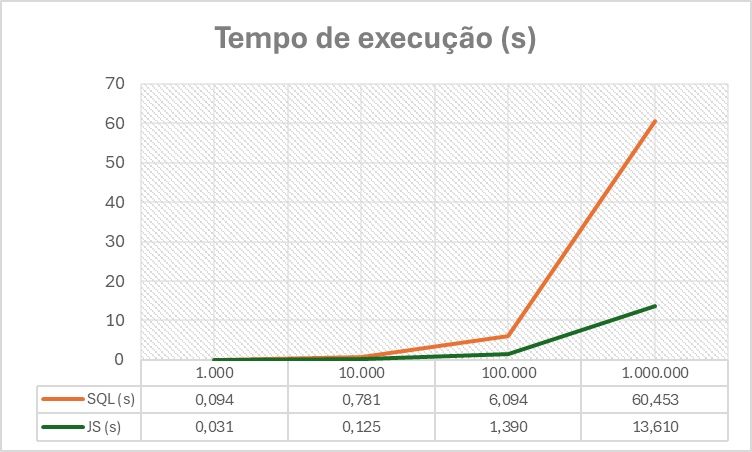

Gráfico de barras comparando o tempo de execução (em segundos) entre as funções SQL e JS no teste realizado com a base `Disneyland Reviews`:

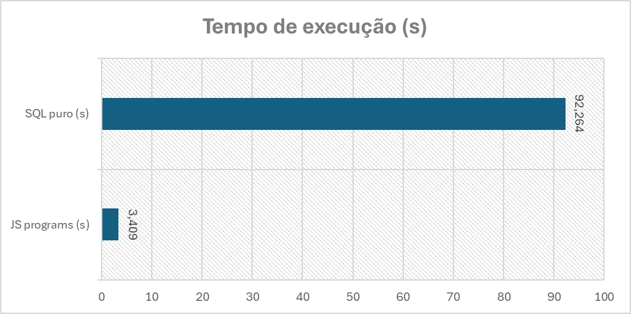

**Conclusões:**

- A função em JavaScript foi melhor em todos os testes.
- O ganho de performance com JS Programs ficou entre 67% e 96%.
- Nos testes de BENCHMARK, a função com JS Programs ficou entre 3x e 6x mais rápida.
- No cenário real, a função em JS foi 27 vezes mais rápida que o SQL.

## Comparativo entre funções UPPER, LENGTH e TO_BASE64

Aproveitando os registros da base Disneyland Reviews, realizei testes comparativos entre funções nativas do SQL (como `UPPER`, `LENGTH` e `TO_BASE64`) e versões equivalentes implementadas em JS Programs. O objetivo foi avaliar o desempenho e a eficiência das funções JavaScript em relação às funções SQL tradicionais.

Abaixo segue as funções criadas em JS programs para esse teste:

- [fn_js_base64](sql_queries/fn_js_base64.sql)
- [fn_js_length](sql_queries/fn_js_length.sql)
- [fn_js_upper_case](sql_queries/fn_js_upper_case.sql)

Obtive os seguintes resultados dos testes, fiz usando a base da Disneyland Reviews e um BENCHMARK simulando 1.000.000 registros.

Comparativo da função UPPER:
```
+------------------------------------------------------------------+---------------------+
| Query                                                            | Tempo decorrido (s) |
+------------------------------------------------------------------+---------------------+
| SELECT UPPER(Review_Text) FROM disneyland_reviews                | 0.703               |
| SELECT fn_js_upper_case(Review_Text) FROM disneyland_reviews     | 1.516               |
+------------------------------------------------------------------+---------------------+
| SELECT BENCHMARK(1.000.000, UPPER('Lorem Ipsum ...'))            | 0.282               |
| SELECT BENCHMARK(1.000.000, fn_js_upper_case('Lorem Ipsum ...')) | 8.515               |
+------------------------------------------------------------------+---------------------+
```

Comparativo da função LENGTH:
```
+---------------------------------------------------------------+---------------------+
| Query                                                         | Tempo decorrido (s) |
+---------------------------------------------------------------+---------------------+
| SELECT LENGTH(Review_Text) FROM disneyland_reviews            | 0.031               |
| SELECT fn_js_length(Review_Text) FROM disneyland_reviews      | 0.547               |
+---------------------------------------------------------------+---------------------+
| SELECT BENCHMARK(1.000.000, LENGTH('Lorem Ipsum ...'))        | 0.015               |
| SELECT BENCHMARK(1.000.000, fn_js_length('Lorem Ipsum ...'))  | 6.922               |
+---------------------------------------------------------------+---------------------+
```

Comparativo da função TO_BASE64:
```
+---------------------------------------------------------------+---------------------+
| Query                                                         | Tempo decorrido (s) |
+---------------------------------------------------------------+---------------------+
| SELECT LENGTH(Review_Text) FROM disneyland_reviews            | 0.031               |
| SELECT fn_js_length(Review_Text) FROM disneyland_reviews      | 0.547               |
+---------------------------------------------------------------+---------------------+
| SELECT BENCHMARK(1.000.000, LENGTH('Lorem Ipsum ...'))        | 0.015               |
| SELECT BENCHMARK(1.000.000, fn_js_length('Lorem Ipsum ...'))  | 6.922               |
+---------------------------------------------------------------+---------------------+
```

> Foi usado o texto `Lorem Ipsum is simply dummy text of the printing and typesetting industry.` como exemplo no teste no BENCHMARK.

Tabela detalhada:

| Função          | Teste              | Tempo SQL (s) | Tempo JS (s) | Speedup (x) | Ganho (%) |
| --------------- | ------------------ | ------------- | ------------ | ----------- | --------- |
| UPPER           | Disneyland Reviews | 0.703         | 1.516        | 2.16x       | 53.7 %    |
| UPPER           | Benchmark          | 0.282         | 8.515        | 30.2x       | 96.7 %    |
| LENGTH          | Disneyland Reviews | 0.031         | 0.547        | 17.6x       | 94.3 %    |
| LENGTH          | Benchmark          | 0.015         | 6.922        | 461.5x      | 99.8 %    |
| TO_BASE64       | Disneyland Reviews | 0.797         | 2.297        | 2.88x       | 65.3 %    |
| TO_BASE64       | Benchmark          | 0.093         | 10.641       | 114.5x      | 99.1 %    |

*(s) = tempo em segundos*

Visualizando em um gráfico de colunas, fica claro a diferença de tempo gasto entre as funções de SQL nativas contra JS programs:

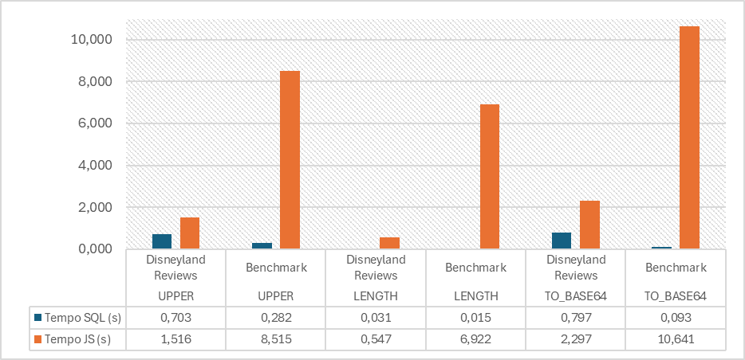

Analisando os resultados desses testes, foi observado que:

- As funções internas do MySQL (como UPPER, LENGTH e TO_BASE64) são altamente otimizadas, com praticamente nenhum overhead de execução.
- As funções em JS Programs possuem overhead adicional devido à comunicação com o motor JavaScript, tornando operações simples mais lentas em comparação às funções nativas.
- Para operações simples e já disponíveis no MySQL, as funções nativas oferecem mais praticidade e velocidade.
- JS Programs só compensam em tarefas complexas ou para operações que não possuem equivalente nativo em SQL.

## Criando função de ULID

Resumidamente, ULID é um tipo de identificador único, parecido com o UUID, mas com uma vantagem: ele é ordenável. Ou seja, se eu gerar um ULID agora e outro daqui a alguns instantes, o segundo vai aparecer depois do primeiro quando for ordenado alfabeticamente. Um ULID tem 128 bits e pode ser representado como uma string de 26 caracteres.

Ele é dividido em duas partes:

- Primeiros 10 caracteres: representam o timestamp (quando foi gerado).
- Últimos 16 caracteres: são valores aleatórios, garantindo que não tenha colisão.

O MySQL não tem uma função nativa pra gerar ULID, então eu criei duas alternativas:

- Uma função que gera ULID usando SQL puro ([fn_sql_ulid](sql_queries/fn_sql_ulid.sql))
- Outra função que gera ULID usando JavaScript (JS Programs) dentro do MySQL ([fn_js_ulid](sql_queries/fn_js_ulid.sql))

A ideia é bem simples: testar se a geração do ULID via JavaScript é mais rápida do que a geração via SQL.

Fiz o teste utilizando o `BENCHMARK`, indo de 1.000 até 1.000.000 interações.

Resultados obtidos:

```
+---------------------------------------------+ 
|                  BENCHMARK                  |
+-----------+-----------------+---------------+ 
| Iterações | fn_sql_ulid (s) | fn_js_ulid(s) |
+-----------+-----------------+---------------+ 
| 1.000     | 0,110           | 0,031         |
| 10.000    | 1,234           | 0,109         |
| 100.000   | 9,657           | 0,953         |
| 1.000.000 | 108,344         | 7,609         |
+-----------+-----------------+---------------+ 
```
*(s) = tempo em segundos*

> Você pode ver a query que utilizei neste teste do `BENCHMARK` aqui: [benchmark_ulid](sql_queries/benchmark_ulid.sql).

E também testei utilizando a base [Employees Sample Database](https://dev.mysql.com/doc/employee/en/) para simular a adição de um campo ULID em um cenário real.

Foi adicionado um campo ``ulid`` na tabela ``employees``.

```sql
ALTER TABLE `employees`.`employees` ADD COLUMN `ulid` CHAR(26) NULL;
```

Depois fiz a atualização do campo:

```sql
-- Atualizando com a função SQL:
UPDATE
	employees
SET
	ulid = fn_sql_ulid()
WHERE
	ulid IS NULL;

-- Atualizando com a função JS programs:
UPDATE
	employees
SET
	ulid = fn_sql_ulid()
WHERE
	ulid IS NULL;
```

> A tabela `employees` possui 300.024 registros.

Resultados obtidos:

```
+----------------------------------------------------+
|                  UPDATE employees                  |
+-----------------+-----------------+----------------+
| Linhas Afetadas | fn_sql_ulid (s) | fn_js_ulid (s) |
+-----------------+-----------------+----------------+
| 300.024         | 47,047          | 14,016         |
+-----------------+-----------------+----------------+
```
*(s) = tempo em segundos*

Depois dessa bateria de testes, deixo os resultados abaixo:

| Cenário          | Iterações / Registros | Tempo SQL (s) | Tempo JS (s) | Speedup (x) | Ganho (%) |
| ---------------- | --------------------- | ------------- | ------------ | ----------- | --------- |
| BENCHMARK        | 1.000                 | 0,110         | 0,031        | 3,55x       | 71,8%     |
| BENCHMARK        | 10.000                | 1,234         | 0,109        | 11,32x      | 91,2%     |
| BENCHMARK        | 100.000               | 9,657         | 0,953        | 10,13x      | 90,1%     |
| BENCHMARK        | 1.000.000             | 108,344       | 7,609        | 14,24x      | 93,0%     |
| UPDATE employees | 300.024               | 47,047        | 14,016       | 3,36x       | 70,2%     |

Gráfico de linhas com as comparações de tempo de execução do teste de BENCHMARK:

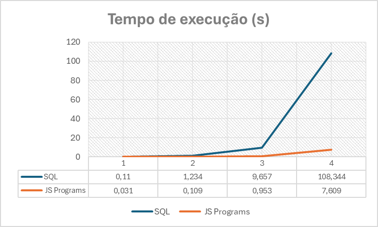

Gráfico de barras com as comparações de tempo de execução do teste de UPDATE na tabela `employyes`:

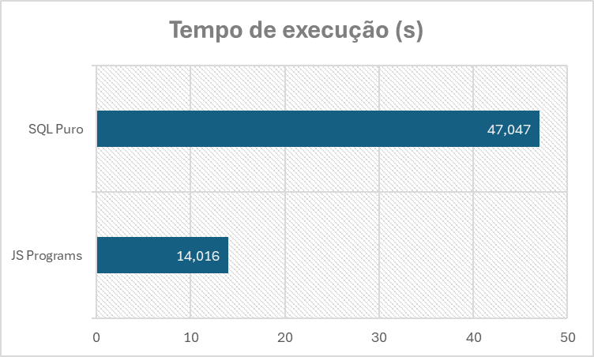

**Conclusões:**

Nos testes com BENCHMARK, a função em **JS programs** mostrou ganhos consistentes e consideraveis, chegando a 14 vezes mais rápido em 1 milhão de iterações.

Em cenário real de UPDATE em tabela `employees`, o ganho foi menor utilizando a função em **JS programs**, mas ainda expressivo: cerca de 70% de ganho de perfomance, sendo um pouco mais de 3 vezes mais rápido.

Isso mostra que o overhead de chamadas **SQL puras** é maior para cálculos complexos (nesse exemplo criar ULID), e o motor JS demosntrou nesse teste set mais eficiente para essa lógica.

## Realizando INSERT em loop usando a função ULID

Neste teste, realizei inserções em loop utilizando funções de ULID. Meu objetivo é verificar se existem diferenças de performance entre usar a função SQL e a função JS para inserir registros em loops.

Primeiro, foi criada uma tabela para armazenar os registros: [tb_ulid](sql_queries/tb_ulid.sql).

Em seguida, criei duas procedures para realizar os inserts em loop:

- [sp_insert_ulid_sql](sql_queries/sp_insert_ulid_sql.sql) - usando a função em SQL puro.
- [sp_insert_ulid_js](sql_queries/sp_insert_ulid_js.sql) - usando a função em JavaScript (JS Programs).

As inserções foram realizadas em diferentes volumes, variando de 100 até 100.000 registros.

A query utilizada para realizar os testes está disponível aqui: [call_insert_tb_ulid](sql_queries/call_insert_tb_ulid.sql).

Os resultados obtidos foram bem interessantes, segue abaixo:

| Iterações | Tempo SQL (s) | Tempo JS (s) | Speedup (SQL/JS) | Ganho (SQL/JS) |
| --------- | ------------- | ------------ | ---------------- | -------------- |
| 100       | 0.484         | 0.406        | 1.19x            | 16.1%          |
| 500       | 2.016         | 1.656        | 1.22x            | 17.9%          |
| 1.000     | 4.875         | 3.344        | 1.46x            | 31.4%          |
| 5.000     | 20.641        | 17.188       | 1.20x            | 16.7%          |
| 10.000    | 45.047        | 31.000       | 1.45x            | 31.2%          |
| 50.000    | 205.125       | 182.063      | 1.13x            | 11.2%          |
| 100.000   | 361.109       | 372.203      | 0.97x            | -3.1%          |

*(s) = tempo em segundos*

Visualizando em um gráfico de linhas:

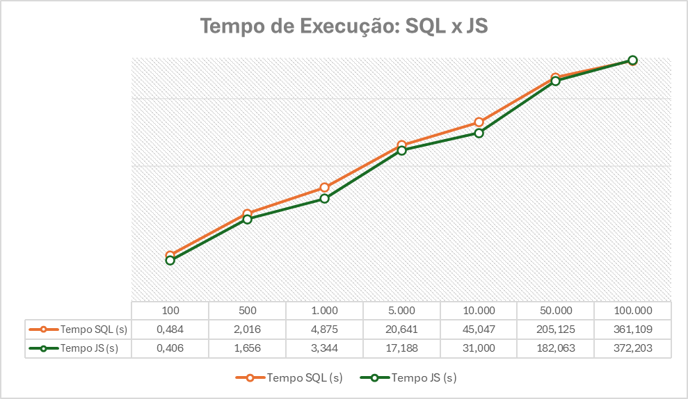

**Conclusões:**

- A diferença entre as funções SQL e JS na operação de INSERT não é tão significativa em comparação ao UPDATE.
- A instrução de UPDATE tende a usar mais CPU, enquanto o INSERT em loop é I/O-bound (escritas em disco, transações repetidas), minimizando o impacto da função ULID (CPU-bound). Ganhos com a função JS aparecem mais em volumes médios (100-10k inserts).
- O custo de geração do ULID (SQL ou JS) é relativamente pequeno, o que torna o impacto da função quase irrelevante nos volumes pequenos e médios.
- O ganho da função JS sobre SQL ficou entre 11% e 31% na maior parte dos testes.
- Em volumes baixos a médios (100 a 10k), a função JS teve vantagem consistente.
- Em volumes mais altos (50k a 100k), a diferença fica equilibrada. Em 100k inserts, o SQL superou o JS (pouco mais de 3%), mostrando que em volumes mais altos o SQL pode ser ligeiramente melhor devido a overheads no motor JS ou variações de I/O.

# Erros comuns

Deixo aqui alguns problemas que enfrentei durante este projeto, assim, caso alguém passe pela mesma dificuldade, pode consultar as soluções abaixo.

## Erro ao conectar via GUI:

Caso, ao tentar conectar ao banco via alguma GUI, como o **DBeaver**, você receba um erro semelhante a este:

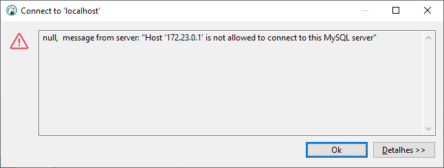

> "Host '172.23.0.1' is not allowed to connect to this MySQL server"

Isso significa que o usuário que você está tentando usar **não tem permissão** para se conectar a partir do host que você está usando.  

No exemplo acima, o MySQL recebeu a conexão do IP do host Docker (`172.23.0.1`), mas o usuário `root` não está autorizado a se conectar de lá.

Execute o script de configuração de permissões dentro do container:

```bash
docker exec -it my-percona bash /tmp/grant_root_permission.sh
```

## Erro: "This function has none of DETERMINISTIC":

Se você tentar criar uma função no MySQL e receber:

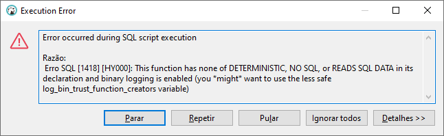

> ERROR 1418 (HY000): This function has none of DETERMINISTIC, NO SQL, or READS SQL DATA in its declaration and binary logging is enabled (you might want to use the less safe log_bin_trust_function_creators variable)

É porque o binlog (registro de alterações do banco) está ativo e o MySQL quer que você diga se a função é determinística ou se lê/modifica dados.

Pode solucionar usando um dos métodos abaixo:

1. Adicionar as marcações na função:

- DETERMINISTIC ou NOT DETERMINISTIC
- NO SQL, READS SQL DATA ou MODIFIES SQL DATA

2. Ou, se você não quiser declarar DETERMINISTIC/NO SQL, pode permitir que qualquer função seja criada mesmo com binlog ativo:

```sql
SET GLOBAL log_bin_trust_function_creators = 1;
```

Isso permite criar funções sem marcar determinismo ou tipo de SQL.

## Erro de privilégio CREATE_JS_ROUTINE:

Ao tentar criar uma função ou procedure, recebeu esse erro:

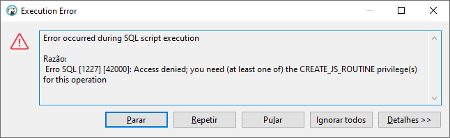

> ERROR 1227 (42000): Access denied; you need (at least one of) the CREATE_JS_ROUTINE privilege(s) for this operation.

Esse erro indica que o usuário atual não possui o privilégio CREATE_JS_ROUTINE necessário para criar stored functions ou procedures em JavaScript no Percona Server for MySQL 8.4.

Para conceder o privilégio, é necessário utilizar um usuário com permissões administrativas (por exemplo, `root`).

Execute o comando abaixo para conceder os privilégios ao seu usuário:

```sql
GRANT CREATE_JS_ROUTINE, CREATE ROUTINE ON *.* TO 'seu_usuario'@'localhost';
FLUSH PRIVILEGES;
```

## Problema ao importar arquivo no MySQL:

Ao tentar importar um arquivo para o MySQL, como por exemplo um CSV, você pode receber o seguinte erro:

```
Error Code: 1290. The MySQL server is running with the --secure-file-priv option
```

Esse erro significa que o MySQL está rodando com a variável `secure_file_priv` habilitada.

Essa variável restringe os diretórios permitidos para importar/exportar arquivos (`LOAD DATA INFILE`, `SELECT ... INTO OUTFILE` e entre outros).

Basicamente, você está tentando carregar um arquivo em um local que o MySQL considera inseguro.

Para descobrir qual é o diretório seguro, execute:

```sql
SHOW VARIABLES LIKE 'secure_file_priv';
```

Exemplo de resultado:

```
+------------------+-----------------------+
|  Variable_name   |         Value         |
+------------------+-----------------------+
| secure_file_priv | /var/lib/mysql-files/ |
+------------------+-----------------------+
```

No meu caso, resolvi o problema movendo o arquivo para o diretório seguro, que no exemplo acima é `/var/lib/mysql-files/`.